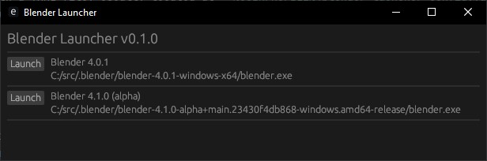

# Simple Blender Launcher

Easily launch different versions of Blender

# Features
- Launch different versions of Blender
- Command line arguments passed to Blender Launcher is also passed to Blender

# Configuration
The launcher is configured with a YAML file, usually located at ``%USERPROFILE%\blender_launcher_config.yaml``.
The config filepath is configurable by the ``BLENDER_LAUNCHER_CONFIG_FILEPATH`` environment variable.
